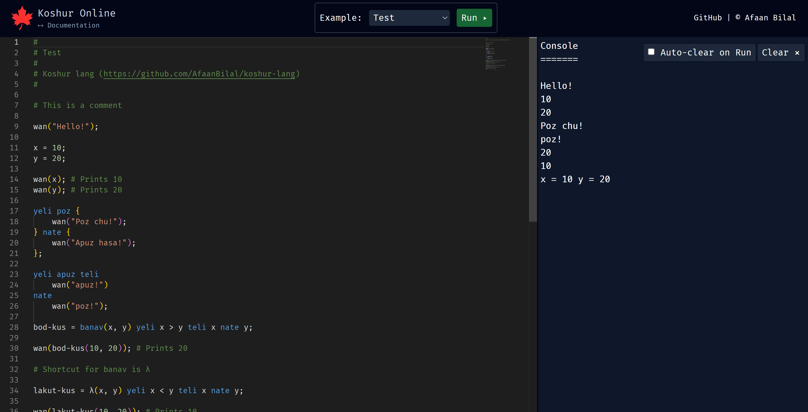

🍁 Koshur Online
================

### Run [Koshur](https://github.com/AfaanBilal/koshur-lang) in your browser here: [Koshur Online](https://koshur.afaan.dev)

### **Author**: [Afaan Bilal](https://afaan.dev)

---

## Screenshots

---

## Examples

- Hello world!
- Arithmetic
- Control Flow
- Functions
- Fibonacci
- Factorial
- Days to Years, Months, Days
- Prime Numbers
- Raise to Power
- Count Digits
- Reverse a Number
- HCF / GCD
- Factors
- nCr
- nPr
- Test

---

## Contributing
All contributions are welcome. Please create an issue first for any feature request
or bug. Then fork the repository, create a branch and make any changes to fix the bug
or add the feature and create a pull request. That's it!
Thanks!

---

## License
**Koshur Online** is released under the MIT License.
Check out the full license [here](LICENSE).
